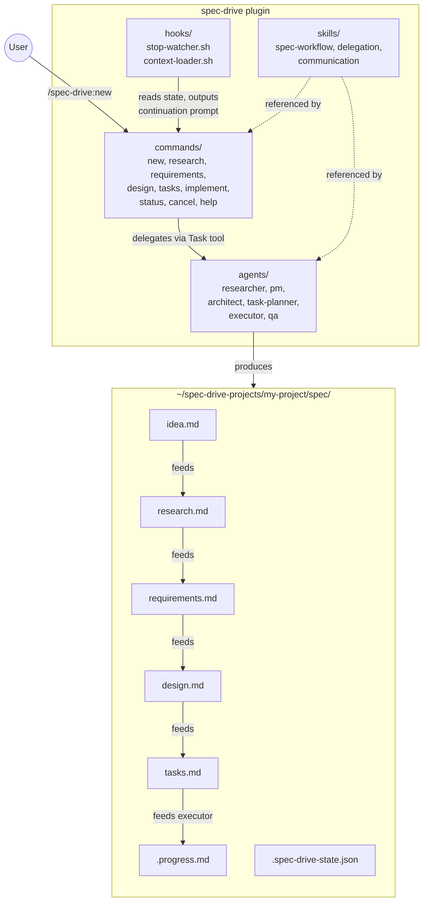
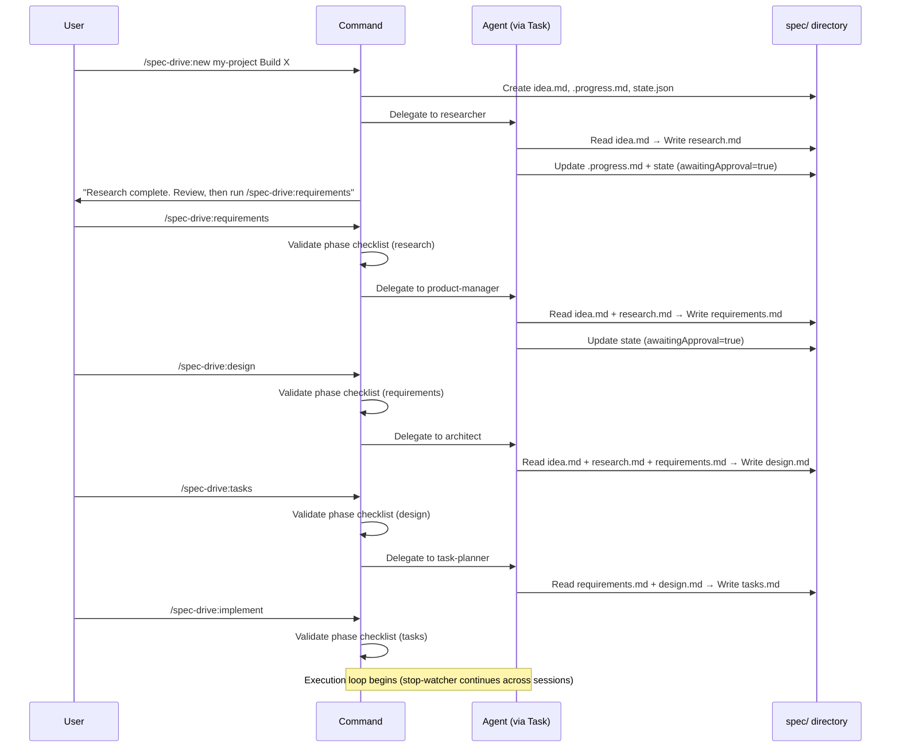
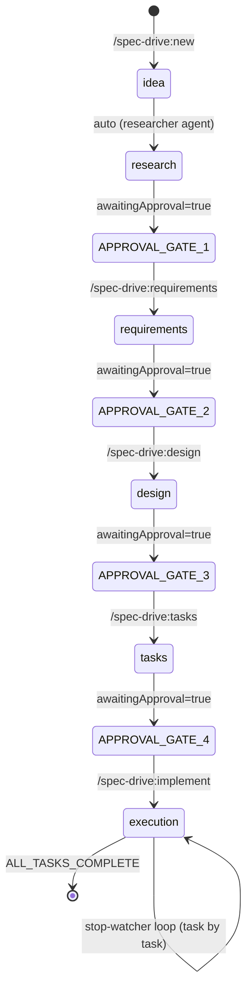
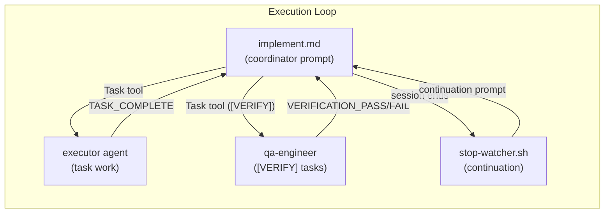
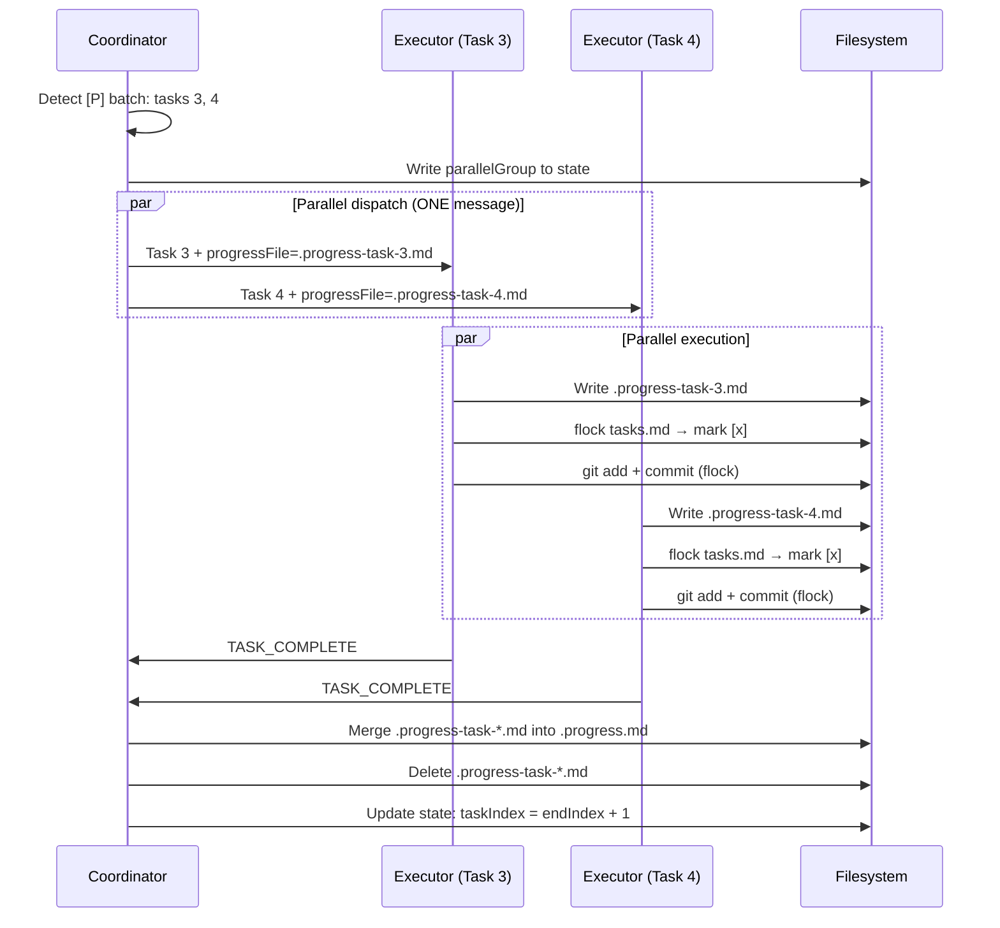
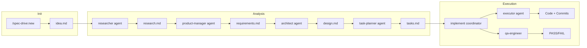

# Design: Spec-Drive — Claude Code Plugin for Spec-Driven Development

## Overview

Spec-Drive is a Claude Code plugin that orchestrates spec-driven development through a document chain (idea.md -> research.md -> requirements.md -> design.md -> tasks.md) with 6 role-based agents, quality gates between phases, and autonomous task execution via a stop-watcher hook. All artifacts are plain Markdown; the plugin infrastructure (agents, commands, hooks, skills) drives the workflow while producing cross-CLI-portable output.

## Architecture



## Plugin Directory Structure

```
spec-drive/
├── .claude-plugin/
│   └── plugin.json
├── agents/
│   ├── researcher.md
│   ├── product-manager.md
│   ├── architect.md
│   ├── task-planner.md
│   ├── executor.md
│   └── qa-engineer.md
├── commands/
│   ├── new.md
│   ├── research.md
│   ├── requirements.md
│   ├── design.md
│   ├── tasks.md
│   ├── implement.md
│   ├── status.md
│   ├── cancel.md
│   └── help.md
├── skills/
│   ├── spec-workflow/
│   │   ├── SKILL.md
│   │   └── references/
│   │       ├── phase-transitions.md
│   │       └── phase-checklists.md
│   ├── delegation-principle/
│   │   └── SKILL.md
│   └── communication-style/
│       └── SKILL.md
├── hooks/
│   ├── hooks.json
│   └── scripts/
│       ├── stop-watcher.sh
│       └── context-loader.sh
├── templates/
│   ├── idea.md
│   ├── research.md
│   ├── requirements.md
│   ├── design.md
│   ├── tasks.md
│   └── progress.md
├── schemas/
│   └── spec-drive.schema.json
└── package.json
```

**File count**: 1 plugin.json + 6 agents + 9 commands + 5 skill files + 3 hook files + 6 templates + 1 schema + 1 package.json = **32 files**

## Components

### 1. plugin.json

```json
{
  "name": "spec-drive",
  "version": "1.0.0",
  "description": "Spec-driven development: idea -> research -> requirements -> design -> tasks -> autonomous execution with quality gates.",
  "license": "MIT",
  "keywords": ["spec-driven", "agents", "autonomous", "quality-gates", "document-chain"]
}
```

### 2. Document Chain Flow



**Agent input matrix — what each agent reads directly**:

| Agent | Reads | Produces |
|-------|-------|----------|
| researcher | idea.md | research.md |
| product-manager | idea.md, research.md | requirements.md |
| architect | idea.md, research.md, requirements.md | design.md |
| task-planner | requirements.md, design.md | tasks.md |
| executor | Current task block from tasks.md, .progress.md | Code changes, commits |
| qa-engineer | [VERIFY] task block, requirements.md (for AC checks) | VERIFICATION_PASS/FAIL |

No template variables between phases. Each agent reads predecessor files directly via Read tool. This satisfies AC-2.6.

### 3. State Machine



**State file schema** (`.spec-drive-state.json`):

```json
{
  "name": "string (project name)",
  "basePath": "string (e.g., ~/spec-drive-projects/my-project/spec)",
  "phase": "idea | research | requirements | design | tasks | execution",
  "taskIndex": "integer (0-based, current task)",
  "totalTasks": "integer",
  "taskIteration": "integer (retry count for current task, resets per task)",
  "maxTaskIterations": "integer (default: 5)",
  "globalIteration": "integer (total loop iterations across all tasks)",
  "maxGlobalIterations": "integer (default: 100)",
  "awaitingApproval": "boolean",
  "parallelGroup": {
    "startIndex": "integer",
    "endIndex": "integer",
    "taskIndices": "[integer]",
    "isParallel": "boolean"
  },
  "taskResults": {
    "<taskIndex>": { "status": "pending | success | failed", "error": "string?" }
  }
}
```

**State transitions**:

| Trigger | From | To | Sets |
|---------|------|----|------|
| `/spec-drive:new` | (none) | research | phase=research |
| Researcher completes | research | research | awaitingApproval=true |
| `/spec-drive:requirements` | research | requirements | awaitingApproval=false, then true after PM |
| `/spec-drive:design` | requirements | design | awaitingApproval=false, then true after architect |
| `/spec-drive:tasks` | design | tasks | awaitingApproval=false, then true after planner |
| `/spec-drive:implement` | tasks | execution | awaitingApproval=false, sets task fields |
| Task complete | execution | execution | taskIndex++, taskIteration=1 |
| ALL_TASKS_COMPLETE | execution | (done) | State file deleted |

### 4. Execution Engine

The execution engine has three components: the coordinator (implement command), the stop-watcher hook, and the executor agent.



**Coordinator responsibilities** (implement.md):
1. Read state file, determine current task
2. Parse task from tasks.md at taskIndex
3. Detect [P] for parallel, [VERIFY] for QA delegation
4. Delegate to executor or qa-engineer via Task tool
5. On TASK_COMPLETE: advance taskIndex, update state
6. On failure: increment taskIteration, retry or stop at max
7. When taskIndex >= totalTasks: output ALL_TASKS_COMPLETE

**The coordinator NEVER implements tasks directly.** This is enforced by the delegation-principle skill.

### 5. Agent Prompt Architecture

All 6 agents share these patterns:

**Frontmatter format**:
```yaml
---
name: <agent-name>
description: <when to invoke this agent — keyword triggers>
model: inherit
---
```

**Common structure in every agent prompt**:
1. Role definition (1-2 sentences)
2. "When Invoked" — what inputs the agent receives
3. Input reading instructions (which files, from basePath)
4. Execution flow (numbered steps)
5. Output format (what to write, where)
6. Progress update instructions (append to .progress.md)
7. `<mandatory>` blocks for critical constraints

**Per-agent specifics**:

| Agent | Key Constraint | Output | Signals |
|-------|---------------|--------|---------|
| researcher | Web search + codebase exploration | research.md | (none — command handles state) |
| product-manager | US/AC format, FR/NFR tables | requirements.md | (none) |
| architect | Reference ACs, mermaid diagrams | design.md | (none) |
| task-planner | POC-first phases, [P]/[VERIFY] markers | tasks.md | (none) |
| executor | Fresh context ONLY (task + .progress.md), autonomous, never asks questions | Code + commits | TASK_COMPLETE |
| qa-engineer | Runs verification commands, mock quality checks | Learnings in .progress.md | VERIFICATION_PASS / VERIFICATION_FAIL |

**Fresh context isolation** (executor only, AC-14.1 through AC-14.4):
- Executor receives ONLY: task definition block + .progress.md content
- Does NOT receive research.md, requirements.md, design.md, or other task definitions
- If executor needs broader context, it reads files on demand via Read tool

### 6. Hook Implementation

#### hooks.json

```json
{
  "description": "Spec-Drive hooks for execution loop and session context",
  "hooks": {
    "Stop": [
      {
        "hooks": [
          {
            "type": "command",
            "command": "${CLAUDE_PLUGIN_ROOT}/hooks/scripts/stop-watcher.sh"
          }
        ]
      }
    ],
    "SessionStart": [
      {
        "hooks": [
          {
            "type": "command",
            "command": "${CLAUDE_PLUGIN_ROOT}/hooks/scripts/context-loader.sh"
          }
        ]
      }
    ]
  }
}
```

#### stop-watcher.sh — Execution Loop Driver

**Input**: JSON on stdin with `cwd`, `transcript_path` fields (from Claude Code hook system)

**Algorithm**:

```
1. Read JSON input from stdin (cwd, transcript_path)
2. Find active project:
   a. Check cwd for .spec-drive-state.json
   b. If not found, scan ~/spec-drive-projects/*/spec/.spec-drive-state.json
      for phase=execution + awaitingApproval=false
   c. If no active project → exit 0
3. Validate state file (jq empty — catch corruption)
   → On corrupt: output recovery instructions, exit 0
4. Check transcript for ALL_TASKS_COMPLETE → exit 0 (loop done)
5. Check globalIteration >= maxGlobalIterations → output error, exit 0
6. If phase=execution AND taskIndex < totalTasks:
   → Output continuation prompt (abbreviated coordinator instructions)
7. Cleanup orphaned .progress-task-*.md files older than 60 minutes
8. exit 0
```

**Continuation prompt** (abbreviated — full spec lives in implement.md):

```
Continue spec: $PROJECT_NAME (Task $((TASK_INDEX+1))/$TOTAL_TASKS, Iter $GLOBAL_ITERATION)

## State
Path: $SPEC_PATH | Index: $TASK_INDEX | Iteration: $TASK_ITERATION/$MAX_TASK_ITER

## Resume
1. Read $SPEC_PATH/.spec-drive-state.json and $SPEC_PATH/tasks.md
2. Delegate task $TASK_INDEX to executor (or qa-engineer for [VERIFY])
3. On TASK_COMPLETE: verify, update state, advance
4. If taskIndex >= totalTasks: delete state file, output ALL_TASKS_COMPLETE

## Critical
- Delegate via Task tool - do NOT implement yourself
- On failure: increment taskIteration, retry up to max
```

**Project discovery** — since projects live in `~/spec-drive-projects/` (not cwd), the stop-watcher needs to find them:

```bash
# Primary: check if cwd itself has a spec/ subdir with state
if [ -f "$CWD/spec/.spec-drive-state.json" ]; then
    SPEC_PATH="$CWD/spec"
# Secondary: check configured project root
elif [ -d "$PROJECT_ROOT" ]; then
    # Find first project in execution phase
    for dir in "$PROJECT_ROOT"/*/spec; do
        state="$dir/.spec-drive-state.json"
        if [ -f "$state" ] && jq -e '.phase == "execution" and .awaitingApproval == false' "$state" >/dev/null 2>&1; then
            SPEC_PATH="$dir"
            break
        fi
    done
fi
```

The `PROJECT_ROOT` defaults to `~/spec-drive-projects/` and is configurable via `.spec-drive-config.json`.

#### context-loader.sh — Session Start

**Purpose**: On session start, detect active project and output status to stderr for agent awareness.

**Algorithm**:
```
1. Read JSON input (cwd)
2. Find active project (same discovery as stop-watcher)
3. If no active project → exit 0
4. Read state file → output phase, task progress, approval status to stderr
5. If awaitingApproval → suggest next command
6. Output original goal from .progress.md to stderr
```

### 7. Configuration

**`.spec-drive-config.json`** — per-project or global config.

**Discovery order**:
1. `$PROJECT_ROOT/spec/.spec-drive-config.json` (project-level)
2. `~/spec-drive-projects/.spec-drive-config.json` (global for all projects)
3. Built-in defaults

**Schema**:

```json
{
  "projectRoot": "~/spec-drive-projects",
  "parallel": {
    "maxConcurrency": 2,
    "progressFilePrefix": ".progress-task-"
  },
  "execution": {
    "maxTaskIterations": 5,
    "maxGlobalIterations": 100
  },
  "git": {
    "autoCommit": true,
    "autoPush": false
  }
}
```

| Setting | Default | Purpose |
|---------|---------|---------|
| projectRoot | ~/spec-drive-projects | Where `/spec-drive:new` creates projects |
| parallel.maxConcurrency | 2 | Max [P] tasks running simultaneously |
| execution.maxTaskIterations | 5 | Max retries per task before stopping |
| execution.maxGlobalIterations | 100 | Safety cap on total loop iterations |
| git.autoCommit | true | Executor commits after each task |
| git.autoPush | false | Auto-push after commit (off by default) |

### 8. QA Loop — Retry Mechanism

```mermaid
graph TD
    Start[Coordinator reads task] --> IsVerify{[VERIFY]?}
    IsVerify -->|Yes| DelegateQA[Delegate to qa-engineer]
    IsVerify -->|No| DelegateExec[Delegate to executor]
    DelegateExec --> ExecResult{TASK_COMPLETE?}
    ExecResult -->|Yes| Advance[taskIndex++, taskIteration=1]
    ExecResult -->|No| IncrRetry[taskIteration++]
    DelegateQA --> QAResult{VERIFICATION_PASS?}
    QAResult -->|Yes| Advance
    QAResult -->|No| IncrRetry
    IncrRetry --> MaxRetry{taskIteration > max?}
    MaxRetry -->|No| WriteFailContext[Append failure to .progress.md]
    WriteFailContext --> RetryTask[Retry same task with failure context]
    RetryTask --> IsVerify
    MaxRetry -->|Yes| Stop[STOP: Max retries reached]
```

**Failure context propagation**:
1. On failure, coordinator extracts error details from agent output
2. Appends to `.progress.md` Learnings section:
   ```markdown
   ### Task X.Y Retry (attempt N)
   - Error: <description>
   - Attempted fix: <what was tried>
   - Next: Retry with adjusted approach
   ```
3. Next retry receives updated .progress.md with failure context
4. After maxTaskIterations reached: loop stops with clear error message

### 9. Parallel Task Execution



**File locking** — parallel executors share two critical resources:
1. `tasks.md` — marking tasks [x] → `flock` around write
2. `git` operations — commits must be serialized → `flock` around git add/commit

Locking command pattern in executor:
```bash
flock /tmp/spec-drive-tasks.lock -c "sed -i 's/- \[ \] X.Y/- [x] X.Y/' $SPEC_PATH/tasks.md"
flock /tmp/spec-drive-git.lock -c "git add $FILES && git commit -m '$MSG'"
```

**Progress merge** — after all parallel tasks complete:
```bash
# Append all temp progress files to main .progress.md
for f in $SPEC_PATH/.progress-task-*.md; do
    echo "" >> $SPEC_PATH/.progress.md
    cat "$f" >> $SPEC_PATH/.progress.md
    rm "$f"
done
```

**Batch size** limited by `parallel.maxConcurrency` (default 2). If a [P] batch has 5 tasks and max concurrency is 2, coordinator dispatches in sub-batches of 2.

### 10. Phase Transition Checklists

Defined in `skills/spec-workflow/references/phase-checklists.md` (not hardcoded in commands). This allows customization per AC-10.4.

| Transition | Checklist |
|------------|-----------|
| research -> requirements | research.md exists, has "## Executive Summary", has "## Feasibility Assessment", has "## Open Questions" |
| requirements -> design | requirements.md exists, has at least 1 user story with ACs, has FR table with priorities, has "## Out of Scope" |
| design -> tasks | design.md exists, has "## Components" or "## Component", references AC-* IDs, has "## Technical Decisions" |
| tasks -> execution | tasks.md exists, has at least 1 task matching `- [ ]`, has [VERIFY] checkpoint, tasks have "Verify:" field |

**Validation mechanism** — each command (requirements.md, design.md, tasks.md, implement.md) checks the relevant checklist before proceeding:

```
1. Read phase-checklists.md (from skill references)
2. For current transition, iterate checklist items
3. For each item:
   a. Check file existence (Read tool)
   b. Check section existence (grep in file content)
4. If any item fails: output error with specific failure, suggest fix
5. If all pass: proceed with phase
```

Commands perform this validation at the top of their execution flow, before delegating to any agent.

## Technical Decisions

| Decision | Options Considered | Choice | Rationale |
|----------|-------------------|--------|-----------|
| Project discovery | Scan cwd only; scan configured root; scan both | Scan both (cwd first, then projectRoot) | Stop-watcher needs to find projects regardless of where `claude` was launched |
| State file location | Project root; spec/ subdir; home dir | `<project>/spec/.spec-drive-state.json` | Collocated with artifacts, committed to git per Gab's decision |
| Checklist location | Hardcoded in commands; skill reference file; JSON schema | Skill reference file (phase-checklists.md) | Satisfies AC-10.4 (customizable), readable, no code changes needed |
| Parallel progress isolation | Shared .progress.md with locks; isolated temp files | Isolated .progress-task-N.md, merge after batch | Eliminates write contention entirely; proven pattern from ralph-specum |
| Lock mechanism | Advisory flock; file-based spinlock; no locking | flock (standard Linux utility) | Zero dependencies, reliable, already required by NFR-5 |
| Config discovery | ENV vars; single global file; cascading | Cascading (project > global > defaults) | Standard pattern, project-level overrides for teams |
| Cancel behavior | Delete project; keep project, delete state only | Keep project, delete state + offer full delete | Safer default; user can always `rm -rf` manually |
| Hook project discovery | Only cwd; only projectRoot; both | Both, cwd first | Handles both "launched from project dir" and "launched from anywhere" |

## Data Flow

### Full Spec Cycle



1. User runs `/spec-drive:new my-project Build a REST API` — creates `~/spec-drive-projects/my-project/spec/idea.md` with goal text
2. Researcher reads idea.md, performs web search + codebase analysis, writes research.md. State: awaitingApproval=true
3. User reviews, runs `/spec-drive:requirements` — PM reads idea.md + research.md, writes requirements.md with US/AC/FR/NFR
4. User reviews, runs `/spec-drive:design` — Architect reads all predecessors, writes design.md with components, data flow, decisions
5. User reviews, runs `/spec-drive:tasks` — Planner reads requirements.md + design.md, writes tasks.md with POC-first phases
6. User reviews, runs `/spec-drive:implement` — Coordinator enters execution loop:
   - For each task: delegate to executor (or qa-engineer for [VERIFY])
   - Executor gets ONLY task block + .progress.md
   - On TASK_COMPLETE: advance state
   - On session end: stop-watcher outputs continuation prompt
   - Loop continues until ALL_TASKS_COMPLETE

## Slash Commands Detail

| Command | Description | Prerequisites | Delegates To | Sets State |
|---------|-------------|---------------|-------------|------------|
| new | Create project + idea.md + start research | (none) | researcher | phase=research |
| research | Re-run research phase | idea.md exists | researcher | awaitingApproval=true |
| requirements | Generate requirements | research checklist passes | product-manager | awaitingApproval=true |
| design | Generate design | requirements checklist passes | architect | awaitingApproval=true |
| tasks | Generate task plan | design checklist passes | task-planner | awaitingApproval=true |
| implement | Start execution loop | tasks checklist passes | executor / qa-engineer | phase=execution |
| status | Show project status | (none) | (reads state directly) | (no change) |
| cancel | Stop execution, cleanup | (none) | (direct cleanup) | Deletes state file |
| help | Show available commands | (none) | (outputs text) | (no change) |

**Command frontmatter pattern**:
```yaml
---
description: <one-line description for help listing>
argument-hint: <usage pattern>
allowed-tools: [Read, Write, Task, Bash, Glob]
---
```

Each command:
1. Parses arguments from `$ARGUMENTS`
2. Resolves project path (cwd check, then projectRoot scan)
3. Validates prerequisites (phase checklist)
4. Delegates to appropriate agent via Task tool
5. Updates state file after agent completes
6. Stops and sets awaitingApproval (analysis phases) or enters loop (implement)

## Error Handling

| Error Scenario | Handling Strategy | User Impact |
|----------------|-------------------|-------------|
| Corrupt state file | jq validation fails → output recovery instructions, suggest `/spec-drive:implement` to reinit | Sees error with recovery steps |
| Missing predecessor file | Phase checklist blocks transition → specific error message | "research.md missing. Run /spec-drive:research first" |
| Executor fails task | Increment taskIteration, append failure context to .progress.md, retry | Transparent — retry happens automatically |
| Max retries exceeded | Stop loop with clear error, show failure history from .progress.md | "Task X.Y failed after 5 attempts. Review .progress.md" |
| Max global iterations | Stop loop with safety message | "Safety limit (100) reached. Review for infinite loop patterns" |
| ALL_TASKS_COMPLETE in transcript | stop-watcher detects and exits cleanly | Loop ends naturally |
| Orphaned progress files | stop-watcher cleans up files >60min old | No user impact |
| jq not available | Hook exits cleanly (exit 0) | No hook functionality — manual commands still work |
| Project not found | Commands check cwd and projectRoot, error if neither has project | "No active project. Run /spec-drive:new <name>" |

## Edge Cases

- **Parallel task with one failure**: Other parallel tasks continue. Failed task retried after batch merge. Coordinator detects failure from taskResults in state.
- **Session kill during parallel batch**: Stop-watcher finds partially completed batch. Orphaned .progress-task-*.md files preserved (< 60 min). On resume, coordinator checks which tasks in batch are marked [x] in tasks.md, re-dispatches incomplete ones.
- **State file race condition**: Stop-watcher checks file mtime; if modified in last 2 seconds, waits 1 second before reading. Same pattern as ralph-specum.
- **Empty idea.md goal**: `/spec-drive:new` without goal text prompts user before proceeding (AC-1.3).
- **Re-running a phase**: Running `/spec-drive:research` when research.md already exists overwrites it. State file preserved, phase reset.
- **Cancel during execution**: Deletes state file. Stop-watcher finds no state → exits cleanly. In-flight executor loses its target but commits are already persisted.
- **Project name with P### prefix**: Used as-is (AC-1.1). No automatic P-number assignment.

## Test Strategy

### Smoke Tests (package.json scripts)

```bash
# Validates plugin structure
npm run test:structure   # Verify all required files exist
npm run test:hooks       # Verify hooks.json is valid JSON, scripts are executable
npm run test:schema      # Validate schema file is valid JSON Schema
npm run test:commands    # Verify all commands have required frontmatter fields
```

### Unit Tests (bash-based)

- **stop-watcher.sh**: Feed mock JSON input, verify correct output for each state (no project, awaiting approval, execution in progress, ALL_TASKS_COMPLETE, corrupt state, max iterations)
- **context-loader.sh**: Feed mock JSON, verify stderr output for each project state
- **Phase checklists**: Verify checklist validation against mock spec directories (missing files, missing sections)

### Integration Tests

- **Full cycle**: Create project → research → requirements → design → tasks → implement (with trivial tasks)
- **QA retry loop**: Create project with intentionally failing verify command, confirm retry up to max
- **Parallel batch**: Create tasks.md with [P] tasks, run implement, verify concurrent execution and correct merge
- **Cross-session continuation**: Start implement, kill session, verify stop-watcher outputs correct prompt

### E2E Success Criteria (from requirements)

- Complete spec cycle runs end-to-end on a real project
- Execution loop continues across at least 3 session stops
- QA loop catches at least 1 verification failure and retries successfully
- Artifacts readable by Codex CLI without Spec-Drive installed

## Performance Considerations

- **Agent prompt size**: Target < 4,000 tokens per agent (NFR-2). Executor is largest due to autonomous execution rules.
- **Plugin load time**: < 2 seconds (NFR-1). Achieved by using only .md files + bash scripts — no Node.js runtime at load.
- **Stop-watcher speed**: Must complete in < 1 second. Uses jq for fast JSON parsing, avoids heavy operations.
- **Parallel execution**: Capped at maxConcurrency (default 2) to avoid overwhelming the system. Each parallel executor runs in its own Task subprocess.

## Security Considerations

- **No secrets in state files**: State file contains only workflow metadata (phase, task index, paths). No API keys or tokens.
- **State file committed to git**: Per Gab's decision. Contains no sensitive data, enables team collaboration.
- **flock on shared resources**: Prevents data corruption during parallel execution.
- **Global iteration limit**: Prevents infinite token burn from runaway loops (NFR-4).
- **No external network calls from hooks**: Hooks are pure filesystem operations. Agents may use web search but hooks never do.

## Existing Patterns to Follow

Based on ralph-specum analysis:
- Agent .md files use `name`, `description`, `model: inherit` frontmatter
- Skills use `SKILL.md` + `references/` subdirectory structure
- Commands use `description`, `argument-hint`, `allowed-tools` frontmatter
- hooks.json uses `${CLAUDE_PLUGIN_ROOT}` for portable script paths
- Stop-watcher reads JSON from stdin, uses jq for parsing, outputs to stdout (continuation) or stderr (logging)
- State file uses atomic write pattern: write to .tmp, then mv
- `<mandatory>` blocks in agent prompts for critical constraints
- Coordinator prompt in implement.md is the source of truth; stop-watcher outputs abbreviated resume

## Implementation Steps

1. **Create plugin scaffold** — .claude-plugin/plugin.json, directory structure, package.json with smoke test scripts
2. **Create templates** — idea.md, research.md, requirements.md, design.md, tasks.md, progress.md templates
3. **Create schemas** — spec-drive.schema.json with state file and frontmatter definitions
4. **Create skills** — spec-workflow (SKILL.md + phase-transitions.md + phase-checklists.md), delegation-principle, communication-style
5. **Create hooks** — hooks.json, stop-watcher.sh (execution loop driver), context-loader.sh (session start)
6. **Create agents** — researcher.md, product-manager.md, architect.md, task-planner.md (original prompts, debate-tested)
7. **Create commands** — new.md, research.md, requirements.md, design.md, tasks.md, status.md, help.md
8. **Create executor + QA agents** — executor.md (autonomous, fresh context), qa-engineer.md (verification signals)
9. **Create implement + cancel commands** — implement.md (coordinator prompt, parallel support), cancel.md
10. **Smoke tests** — structure validation, hook tests, checklist validation tests
11. **Integration test** — full cycle on a real project
12. **Think-tank:debate** — stress-test each agent prompt, store transcripts as evidence
